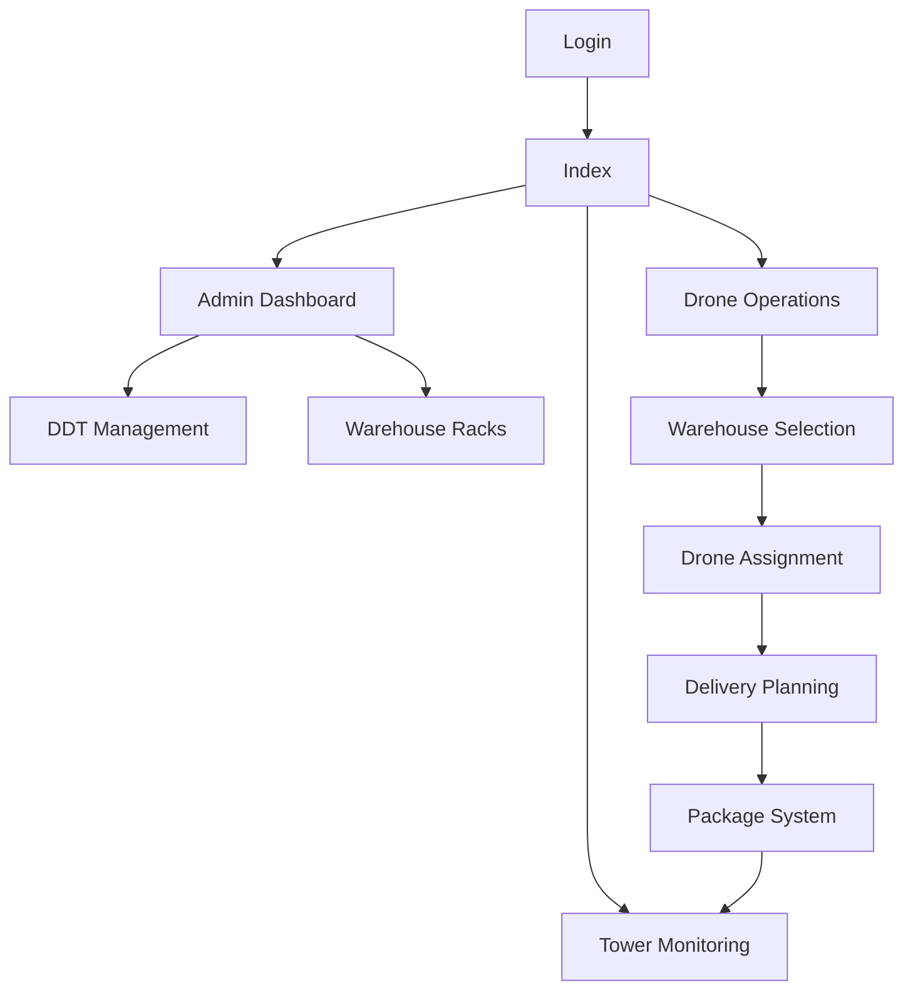
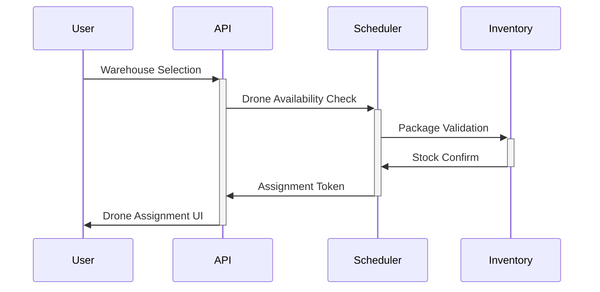
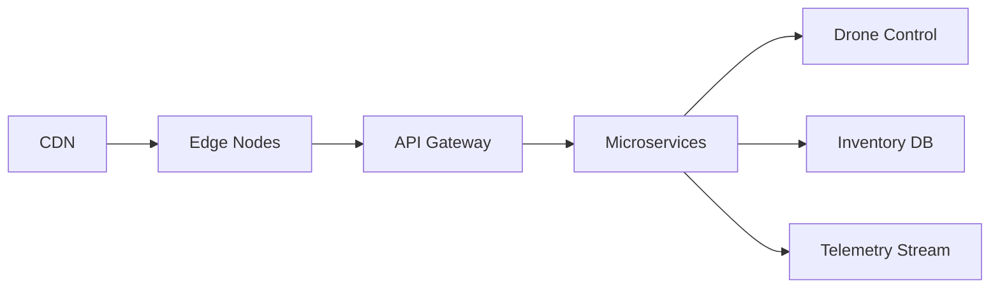

# ShadowFly DroneHub Architecture Presentation

## System Overview


---

## Core Components

### Authentication Layer
- JWT-based session management
- Role-based access control
- Secure cookie storage
- Session timeout handling

### Admin Dashboard Features
- Real-time map visualization
- CSV data import pipeline
- Warehouse capacity monitoring
- Drone fleet status overview

---

## Drone Workflow Architecture


---

## Key Technical Decisions

1. **State Management**
   - Redux-style centralized store
   - Route-specific state hydration
   - Offline capability with service workers

2. **Performance Optimization**
   - WebGL-based 3D visualization
   - Websocket streaming for telemetry
   - Bundle splitting by route modules

3. **Safety Features**
   - Geofencing validation
   - Collision avoidance algorithms
   - Emergency landing protocols
```

---

## Deployment Architecture


---