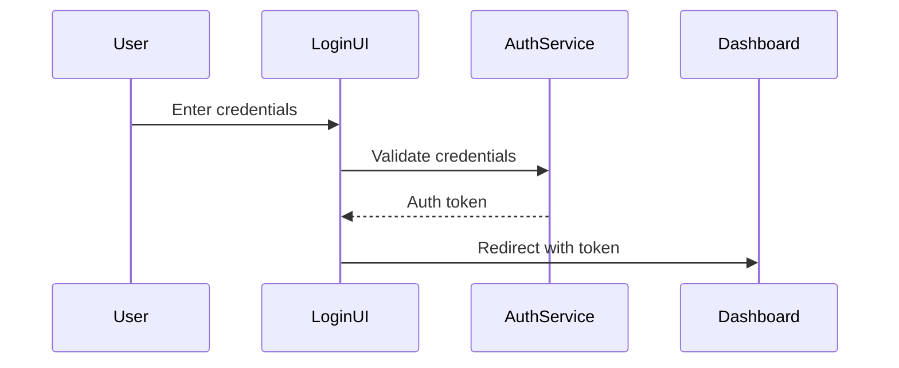

# Site Control System Front-End Workflow Documentation

## Introduction
The Site Control System front-end provides a web-based interface for drone control and monitoring. It consists of an administrative dashboard that communicates with drone systems through gRPC and REST APIs, featuring secure authentication and real-time monitoring capabilities.

## Front-End Architecture

### Core Components
1. **User Interface Layer**
   - Admin Dashboard (`admin-dashboard.html`)
   - Styling (`admin-dashboard.css`)
   - Dashboard Logic (`admin-dashboard.js`)
   - Authentication Interface (`login.js`)

2. **API Integration Layer**
   - gRPC Communication (`mavsdk-grpc.js`)
   - REST Endpoints (`mavsdk-rest.js`)

## Front-End Setup

### Development Prerequisites
- Node.js (v14 or higher)
- Modern web browser
- npm or yarn package manager

### Local Development Setup
1. Install dependencies:
   ```bash
   npm install
   ```
2. Configure environment variables:
   - `MAVSDK_SERVER_URL`
   - `API_ENDPOINTS`
   - `AUTH_CONFIG`

## Front-End Workflow

### 1. Authentication Process


### 2. Dashboard Initialization
1. **Initial Load**
   - Load dashboard components
   - Initialize WebSocket connections
   - Set up real-time data listeners

2. **UI Component Setup**
   - Initialize control panels
   - Set up telemetry displays
   - Configure command interfaces

### 3. Real-Time Data Flow
1. **Telemetry Updates**
   - WebSocket connection established
   - Real-time data streaming
   - UI updates via data binding

2. **Command Interface**
   - User input validation
   - Command queueing
   - Status feedback display

### 4. Error Handling & Recovery
- Connection status monitoring
- Automatic reconnection logic
- User feedback mechanisms
- Error logging and reporting

## UI Components

### Admin Dashboard
The dashboard (`admin-dashboard.js`) provides:
- Drone status monitoring
- Control command interface
- Telemetry visualization
- System health indicators

### Authentication Interface
The login system (`login.js`) handles:
- User credential validation
- Session management
- Security token handling
- Access control

## Build & Deployment

### Development Build
```bash
npm run dev
```

### Production Build
```bash
npm run build
```

### Deployment Process
1. Build production assets
2. Verify API configurations
3. Deploy to web server
4. Validate connections

## Testing & Quality Assurance

### Front-End Testing
1. Unit tests for components
2. Integration testing
3. UI/UX testing
4. Cross-browser compatibility

### Performance Monitoring
- Load time optimization
- Real-time performance metrics
- Resource usage monitoring
- Connection stability tracking

## Security Measures

### Client-Side Security
1. Input sanitization
2. XSS prevention
3. CSRF protection
4. Secure storage handling

### API Security
1. Token-based authentication
2. Request validation
3. Rate limiting
4. Error handling

## Maintenance & Updates

### Regular Maintenance
- Component updates
- Dependency management
- Performance optimization
- Security patches

### Monitoring
- Error tracking
- Usage analytics
- Performance metrics
- User feedback collection

## Future Development

### Planned Enhancements
1. Advanced telemetry visualization
2. Enhanced command interfaces
3. Improved error handling
4. Extended monitoring capabilities

---

For detailed component documentation, refer to:
- Dashboard Implementation: `admin-dashboard.js`
- Authentication System: `login.js`
- API Integration: `mavsdk-grpc.js`, `mavsdk-rest.js`
